# Fluxo Completo da Plataforma Nexa

Este diagrama representa o fluxo de ponta a ponta da plataforma, desde a criação da campanha até o pagamento final ao criador.

```mermaid
sequenceDiagram
    autonumber
    actor Marca as 🏢 Marca (Brand)
    participant Plataforma as 🌐 Sistema Nexa
    actor Criador as 🎨 Criador (Creator)
    participant Pagamento as 💳 Gateway (Stripe)

    Note over Marca, Criador: Fase 1: Criação e Candidatura

    Marca->>Plataforma: Cria Campanha (Briefing, Orçamento, Requisitos)
    Plataforma-->>Marca: Campanha Publicada (Status: Active)
    
    Criador->>Plataforma: Visualiza Campanhas Disponíveis
    Criador->>Plataforma: Envia Proposta (Valor, Prazo, Mensagem)
    Plataforma-->>Marca: Notifica Nova Candidatura

    Note over Marca, Criador: Fase 2: Contratação e Pagamento (Escrow)

    Marca->>Plataforma: Revisa Candidatos
    Marca->>Plataforma: Aprova Proposta do Criador
    Plataforma->>Plataforma: Gera Contrato (Status: Pending Payment)
    
    Marca->>Plataforma: Realiza Pagamento do Contrato (R$ 100,00)
    Plataforma->>Pagamento: Processa Transação
    Pagamento-->>Plataforma: Pagamento Confirmado
    Plataforma->>Plataforma: Contrato Ativo & Valor em Escrow (Retido)
    Plataforma-->>Criador: Notifica Início do Contrato

    Note over Marca, Criador: Fase 3: Execução e Entrega

    Criador->>Plataforma: Envia Entregáveis (Milestones/Uploads)
    Plataforma-->>Marca: Notifica Entrega Realizada
    
    Marca->>Plataforma: Revisa Entregáveis
    alt Rejeição
        Marca->>Plataforma: Solicita Revisão
        Plataforma-->>Criador: Notifica Solicitação de Ajustes
        Criador->>Plataforma: Envia Nova Versão
    else Aprovação
        Marca->>Plataforma: Aprova Entrega Final
    end

    Note over Marca, Criador: Fase 4: Encerramento e Comissão

    Plataforma->>Plataforma: Marca Contrato como Concluído
    
    rect rgb(240, 255, 240)
        Note right of Plataforma: Distribuição Financeira
        Plataforma->>Plataforma: Calcula Taxa da Plataforma (5%)
        Plataforma->>Plataforma: Deduz R$ 5,00 (Receita Nexa)
        Plataforma->>Plataforma: Libera R$ 95,00 para Saldo do Criador
    end

    Plataforma-->>Criador: Notifica Pagamento Liberado
    Criador->>Plataforma: Visualiza Saldo na Carteira
    Criador->>Plataforma: Solicita Saque
    Plataforma->>Pagamento: Processa Transferência (Payout)
```

## Legenda dos Status

*   **Campanha:** `Draft` -> `Published` -> `In Progress` -> `Completed`
*   **Contrato:** `Draft` -> `Pending Payment` -> `Active` -> `Completed`
*   **Pagamento:** `Pending` (Escrow retido) -> `Completed` (Liberado ao criador)
