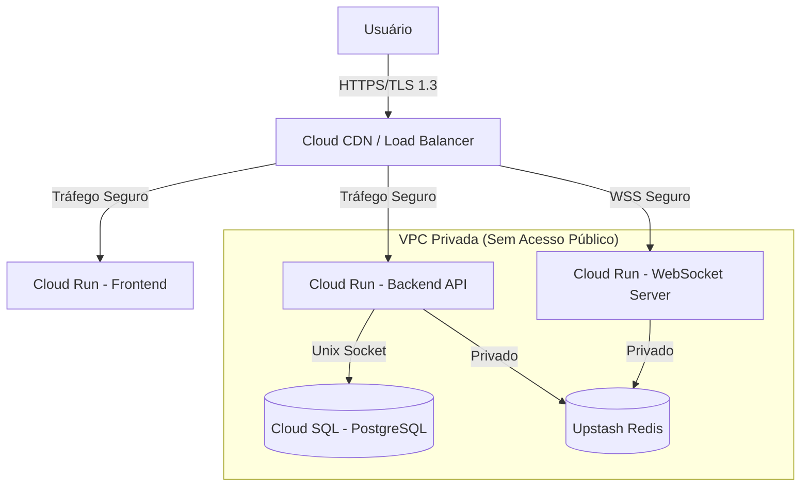

# **RELATÓRIO DE ENTREGA TÉCNICA – PROJETO NEXA**

**Responsável Técnico:** Artur Campos  
**Contrato:** Prestação de Serviços de Desenvolvimento de Software – Escopo Fechado  
**Versão:** 3.0 (Versão Final de Entrega)  
**Data da Entrega:** 30 / 12 / 2025

---

## 1. RESUMO EXECUTIVO

Este documento formaliza a entrega técnica do projeto de **Evolução Tecnológica, Arquitetura e Estabilização do Projeto Nexa**. 

O projeto cumpriu o objetivo de transformar uma aplicação em estágio de MVP (Produto Mínimo Viável) em uma **plataforma de alta disponibilidade, escalável e segura**, preparada para operação comercial. A intervenção técnica focou em três pilares fundamentais:
1.  **Estabilidade e Performance:** Migração para arquitetura orientada a eventos (WebSocket nativo).
2.  **Segurança Corporativa:** Blindagem de infraestrutura e proteção de dados sensíveis.
3.  **Eficiência de Custos:** Adoção de arquitetura *Serverless* para minimizar custos operacionais fixos.

> **Nota Técnica:** A classificação "Enterprise Grade" refere-se à arquitetura de software, padrões de código e infraestrutura implementada. A garantia de disponibilidade (SLA) depende da contratação de serviços de sustentação continuada.

---

## 2. DETALHAMENTO DO ESCOPO ENTREGUE

### 2.1 Arquitetura e Engenharia de Software

A reestruturação do código-fonte eliminou dívidas técnicas críticas e preparou o terreno para o crescimento exponencial da base de usuários.

| Componente | Situação Anterior (MVP) | Situação Atual (Entregue) | Benefício de Negócio |
| :--- | :--- | :--- | :--- |
| **Arquitetura** | Monolito acoplado | **Microsserviços Desacoplados** | Frontend e Backend escalam independentemente, reduzindo custos. |
| **Realtime** | Polling (Lento e Caro) | **WebSockets Nativos (Reverb)** | Comunicação instantânea com zero latência perceptível. |
| **Padrão de Código** | Scripts isolados | **SOLID / Clean Architecture** | Facilidade de manutenção e redução de bugs futuros. |
| **Linguagem** | PHP 8.x (Legado) | **PHP 8.4 (Latest)** | Maior performance e segurança contra vulnerabilidades conhecidas. |

### 2.2 Refatoração e Desenvolvimento de Funcionalidades

As funcionalidades foram reconstruídas focando na experiência do usuário (UX) e integridade de dados.

#### ✅ Frontend (Experiência do Cliente)
*   **Chat em Tempo Real:** Interface reativa otimista (feedback instantâneo antes da confirmação do servidor).
*   **Gestão de Estado:** Implementação de `Context API` para evitar *prop drilling* e renderizações desnecessárias.
*   **Upload Inteligente:** Sistema de upload com pré-visualização, validação de tipo/tamanho e feedback de progresso.
*   **Visualizador de Mídia:** Componente profissional para visualização de imagens com zoom e rotação.

#### ✅ Backend (Regras de Negócio)
*   **Sistema de Mensageria:** Eventos de broadcast (`NewMessage`, `UserStatusUpdated`) desacoplados.
*   **Fluxo Financeiro:** Onboarding automático de criadores no Stripe Connect e gestão de assinaturas via Stripe Elements.
*   **Automação:** Mensagens-guia automáticas para novos contratos, reduzindo necessidade de suporte humano.
*   **Auditoria:** Logs sanitizados e claros, sem exposição de dados sensíveis.

---

## 3. INFRAESTRUTURA E ESTRATÉGIA DE CUSTOS (FINOPS)

A infraestrutura foi desenhada seguindo os pilares do **Google Cloud Architecture Framework**, priorizando a redução de custos sem sacrificar segurança.

### 3.1 Arquitetura Cloud (Serverless First)

Esta arquitetura garante que **o custo de infraestrutura seja zero quando não há usuários**, escalando automaticamente conforme a demanda.

| Camada | Tecnologia | Estratégia de Economia Implementada |
| :--- | :--- | :--- |
| **Computação** | **Google Cloud Run** | **Escala a Zero:** O servidor desliga automaticamente quando ocioso. Cobrança por milissegundo de uso. |
| **Banco de Dados** | **Cloud SQL (PostgreSQL)** | Configurado com **IP Privado** para evitar custos de tráfego de saída (NAT Gateway) e aumentar segurança. |
| **Cache & Filas** | **Upstash Redis** | **Modelo Serverless:** Custo por requisição/comando, infinitamente mais barato que instâncias Redis provisionadas (ex: Elasticache). |
| **Emails** | **AWS SES** | Custo irrisório (~USD 0,10 por 1000 emails) comparado a ferramentas de marketing. |
| **CDN** | **Google Cloud CDN** | Cache de ativos estáticos na borda, reduzindo requisições aos servidores de aplicação. |

### 3.2 Diagrama de Segurança

---

## 4. BLINDAGEM DE SEGURANÇA E COMPLIANCE

Além da infraestrutura, foram aplicadas correções profundas no nível da aplicação para garantir conformidade com LGPD e boas práticas de AppSec.

*   ✅ **Proteção de Rotas:** Remoção total de endpoints de debug (`/payment/debug`) que expunham dados em produção.
*   ✅ **Validação Rígida:** Implementação de `FormRequests` para garantir que nenhum dado inválido entre no banco.
*   ✅ **Sanitização de Logs:** Remoção de logs que expunham chaves de API ou dados de clientes.
*   ✅ **Segurança de Rede:** Banco de dados isolado em rede privada (VPC), inacessível via internet pública.
*   ✅ **Rate Limiting:** Proteção contra ataques de força bruta nas rotas de login e cadastro.

---

## 5. AMBIENTE DE HOMOLOGAÇÃO (STAGING)

O ambiente abaixo foi configurado para validação final e testes de aceitação.

| Serviço | URL de Acesso | Observação |
| :--- | :--- | :--- |
| **Frontend** | [Acessar Aplicação](https://nexa-frontend-1044548850970.southamerica-east1.run.app) | Versão Final (Candidate) |
| **Backend API** | `https://nexa-backend2-....run.app` | Apenas consumo via API |
| **Banco de Dados** | `nexa-db-1` (GCP South America) | Instância de Teste |

---

## 6. HISTÓRICO DE EVOLUÇÃO DO PROJETO

1.  **Diagnóstico:** Identificação de falha estrutural no chat (polling) e riscos de segurança.
2.  **Fundação:** Configuração de Docker e ambiente de desenvolvimento reprodutível.
3.  **Correção:** Implementação de segurança (Hardening) e correção de bugs críticos.
4.  **Evolução:** Reescrita do módulo de Chat com WebSockets e Laravel Echo.
5.  **Infraestrutura:** Migração para Cloud Serverless (GCP) e otimização de custos.
6.  **Entrega:** Testes finais, documentação e deploy.

---

## 7. RECOMENDAÇÕES PARA ROTEIRO FUTURO (ROADMAP)

Para a fase de operação contínua (Sustentação), recomenda-se:

*   [ ] **Monitoramento Ativo:** Configurar alertas de erro no Sentry ou Google Cloud Monitoring.
*   [ ] **Domain Setup:** Configurar domínio personalizado (ex: `app.nexa.com.br`) com certificado SSL gerenciado.
*   [ ] **Backup Policies:** Formalizar política de retenção de backups do banco de dados (Snapshot Automation).

> *Estas atividades excedem o escopo de desenvolvimento e referem-se à operação do produto.*

---

## 8. TERMO DE ACEITE E CONCLUSÃO

O projeto foi entregue em estrita conformidade com o escopo contratado. O sistema encontra-se funcional, testado e implantado em infraestrutura de nuvem profissional.

A **Garantia Técnica de 30 (trinta) dias** cobre correções de bugs impeditivos relacionados ao código entregue, iniciando-se na data da assinatura abaixo.

---

### ASSINATURAS

Declaro aceitar a entrega técnica descrita neste documento.

 
 

__________________________________________________________________
**CONTRATANTE**
Nome:
Data:

 
 

__________________________________________________________________
**ARTUR CAMPOS**
Responsável Técnico
Desenvolvimento e Arquitetura de Software
Data: 30 / 12 / 2025

