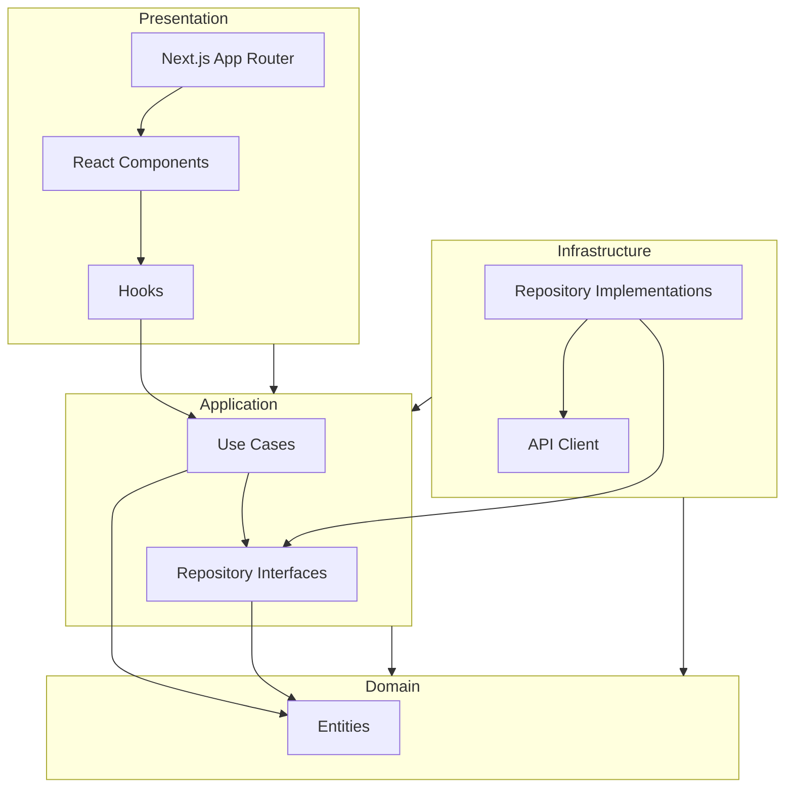

# Arquitetura do Frontend Nexa (Next.js)

Este projeto segue os princípios da **Clean Architecture**, adaptados para o ecossistema React/Next.js. O objetivo é manter a lógica de negócios desacoplada da interface do usuário e de frameworks externos.

## Estrutura de Pastas

```
src/
├── app/                 # Presentation Layer (Next.js App Router)
│   ├── layout.tsx       # Root Layout (Providers globais)
│   ├── page.tsx         # Home Page
│   └── ...              # Rotas da aplicação
├── presentation/        # Presentation Layer (UI Agnostic of Next.js logic)
│   ├── components/      # Componentes Reutilizáveis (Gaia UI)
│   │   ├── ui/          # Componentes Primitivos (Button, Input, etc.)
│   │   └── ...          # Componentes Compostos
│   ├── hooks/           # Custom Hooks de UI
│   └── contexts/        # Contextos React (Theme, Auth)
├── application/         # Application Layer
│   ├── use-cases/       # Casos de Uso (Lógica de aplicação)
│   ├── interfaces/      # Interfaces de Serviços e Estado
│   └── state/           # Gerenciamento de Estado (se necessário)
├── domain/              # Domain Layer (Core Business Logic)
│   ├── entities/        # Entidades do Domínio (Types/Classes)
│   └── repositories/    # Interfaces dos Repositórios
└── infrastructure/      # Infrastructure Layer
    ├── api/             # Implementação de Clientes HTTP (Axios/Fetch)
    ├── repositories/    # Implementação dos Repositórios
    └── adapters/        # Adaptadores para libs externas
```

## Diagrama de Dependências



## Tecnologias

- **Framework**: Next.js 16 (App Router)
- **Linguagem**: TypeScript
- **Estilização**: Tailwind CSS + Gaia UI (Design System Customizado)
- **Gerenciamento de Estado**: React Context / Hooks (ou Redux se necessário)
- **Testes**: Jest + React Testing Library
- **Validação**: Zod
- **Formulários**: React Hook Form

## Padrões

- **Absolute Imports**: Utilize `@/` para importar de `src/`.
- **Server Components**: Páginas (`page.tsx`) são Server Components por padrão. Use `'use client'` apenas quando interatividade for necessária.
- **Feature-Based**: Funcionalidades complexas podem ter seus próprios módulos dentro de `application` ou `presentation`.
